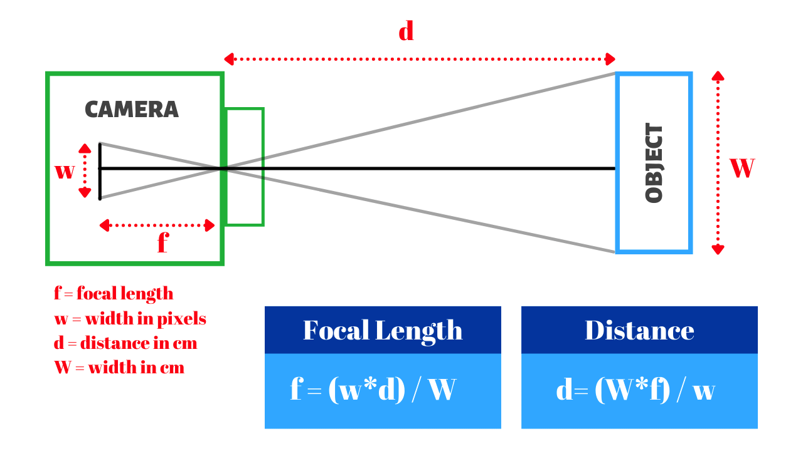

# FaceScanner
Face Scanner for OPAD 2024. Partnered work with NHS clinical practitioners, first steps in development of image segmentation application that scans and allocates the correctly sized NIV masks for pediatric care.  

## Back end Installation
1. Clone the repository
2. Install the required packages on a virtual environment
- Example bash script, for MacOS/Linux:
```bash
python3 -m venv venv
source venv/bin/activate
pip install -r requirements.txt
```

### Current ideas/benchmarks

- [ ] Implementing a face scanner that can detect the face
- [ ] Convert digital measurements to physical measurements, using a reference object with known dimensions
- [ ] Prompt user to be 15 cm away from camera (for eg)
  - https://www.youtube.com/watch?v=jsoe1M2AjFk

