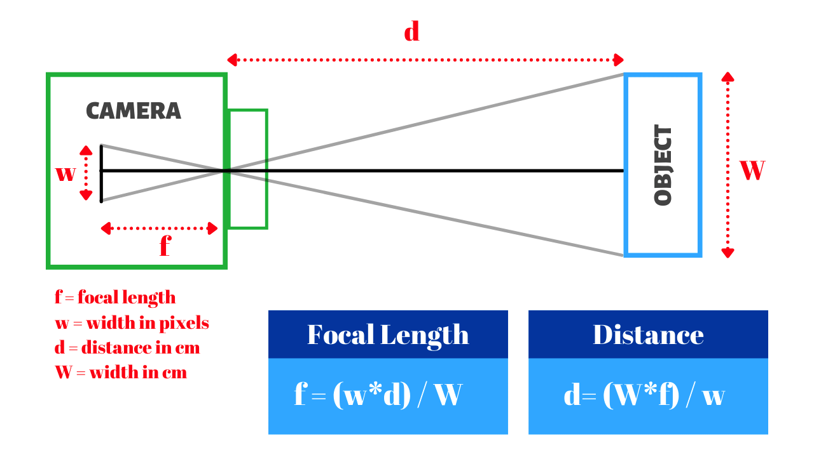

# FaceScanner
Face Scanner for OPAD 2024. Partnered work with NHS clinical practitioners, first steps in development of image segmentation application that scans and allocates the correctly sized NIV masks for pediatric care.  

## Back end Installation
1. Clone the repository
2. Install the required packages on a virtual environment
- Example bash script, for MacOS/Linux:
```bash
python3 -m venv venv
source venv/bin/activate
pip install -r requirements.txt
```

### Current ideas/benchmarks

- [ ] Implementing a face scanner that can detect the face
- [ ] Perform camera calibration calculations that can be applied on multiple devices
- [ ] Do this by Prompt user to be 20 cm away from camera on initialisation
  - https://www.youtube.com/watch?v=jsoe1M2AjFk



- Use the eye distance as a reference maybe? Always between 63-65mm in humans